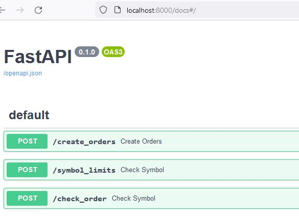
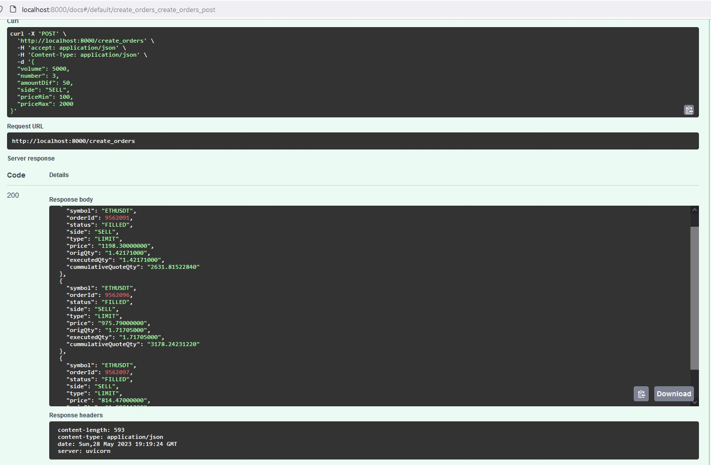
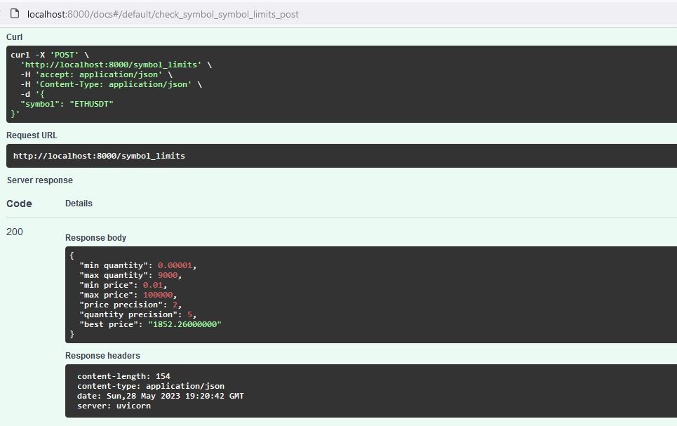
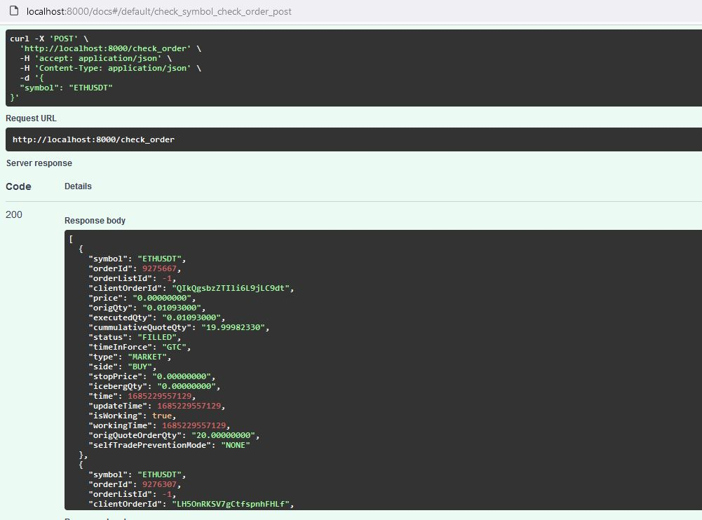

# Binance orders

Веб-сервис, выполняет следующие функции:
1. /create_orders - принимает json (формат ниже), создает ордер(а) и возращает информацию об ордерах

	{   
	"volume": 10000.0,  # Объем в долларах
	"number": 5,  # На сколько ордеров нужно разбить этот объем
	"amountDif": 50.0,  # Разброс в долларах, в пределах которого случайным образом выбирается объем в верхнюю и нижнюю сторону
	"side": "SELL",  # Сторона торговли (SELL или BUY)
	"priceMin": 200.0,  # Нижний диапазон цены, в пределах которого нужно случайным образом выбрать цену
	"priceMax": 300.0  # Верхний диапазон цены, в пределах которого нужно случайным образом выбрать цену
	}

2. /symbol_limits - принимает symbol, возвращает ограничения на ордер и максимальную текущую цену:
3. /check_order - принимает symbol, возвращает текущие ордера по symbol

## Важно!
Настроен тестовый сервер. Для работы на реальном нужно переменую base_url в app/main.py заменить на:

    base_url = "https://api.binance.com"

## Установка
### Клонируем репозиторий

    mkdir app

    cd cat app

    git clone https://github.com/se-andrey/questions.git

### Создаем .env

    nano .env

    API_KEY=
    API_SECRET=

### Запуск

Если на сервере нет docker/docker-compose, то установите его - инстукция https://docs.docker.com/
    
	docker-compose up --build 

docker-compose работает на host 0.0.0.0 и порт 8000, можете изменить в файле docker-compose.yml

### Пример использования

Эндпоинты

Создаем ордера

Провереям symbol

Проверяем ордера по symbol

